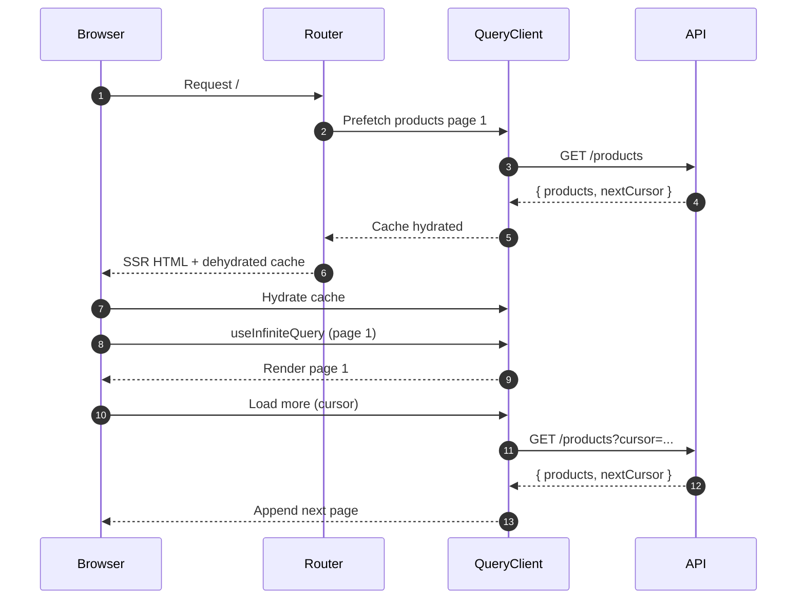
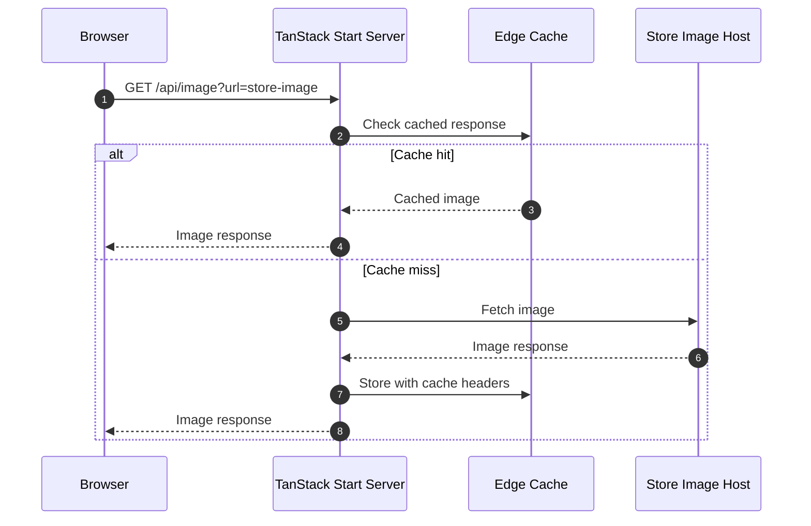

# Architecture Notes

## Product Listing Pagination

### Data Flow (SSR + Client)
1) **Route Loader (SSR)**  
   - Prefetch the first page of products using TanStack Query.
   - Store the result in the query cache for hydration.

2) **Client Hydration**  
   - React Query hydrates the prefetched page on first render.
   - UI shows the first page immediately without a loading flash.

3) **Paginated Fetching**  
   - Use `useInfiniteQuery` with:
     - `queryFn` calling `/products?cursor=...`
     - `getNextPageParam` reading `nextCursor` from the API response.
   - When user clicks “Load more” (or an observer hits the sentinel), fetch the next page.

4) **Rendering**  
   - Flatten `data.pages` into a single array for rendering.
   - Use list virtualization (`@tanstack/react-virtual`) for large lists.
     - Only render the visible window of items and recycle DOM nodes.
     - Keeps the DOM small even if many pages are loaded in memory.
     - Optional: cap in-memory pages (e.g. keep last N pages) to limit memory further.

## Image Proxy & Caching

- Product images are fetched through the app’s image proxy (`/api/image?url=...`) instead of directly from store domains.
- This avoids CORS errors on third-party image hosts and keeps layout stable even when the browser blocks direct reads.
- The proxy sets cache headers for browser + edge caching to improve repeat-load performance and reduce origin hits.

