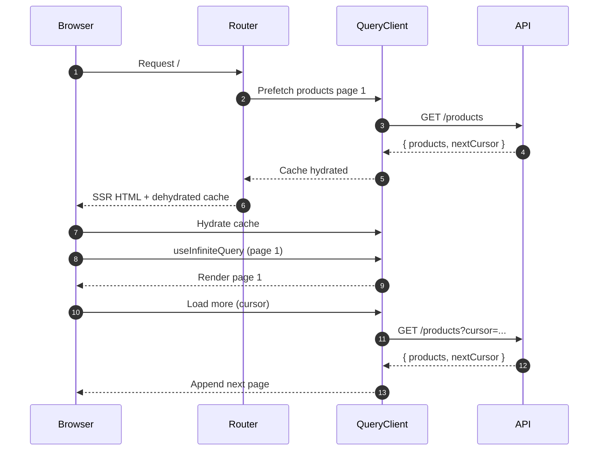
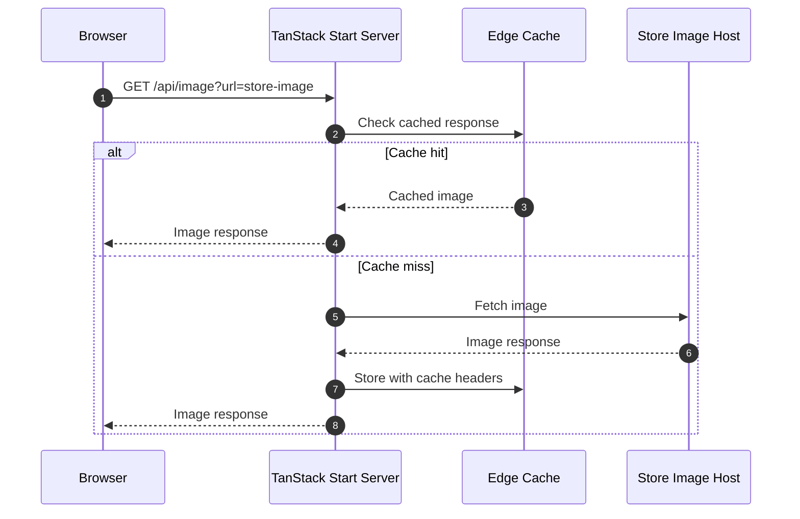
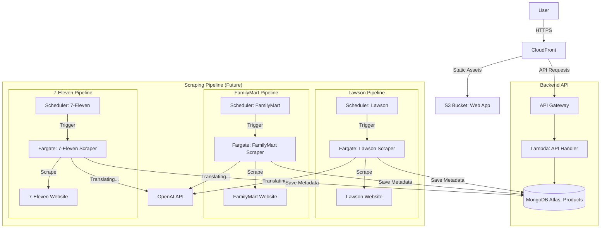
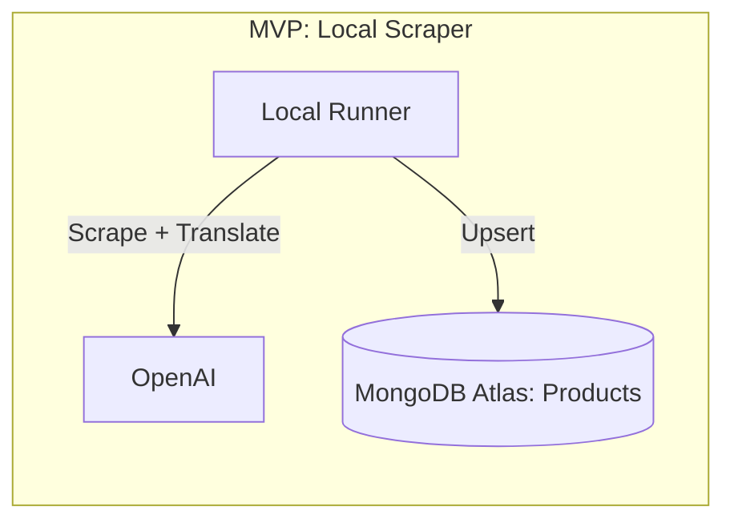
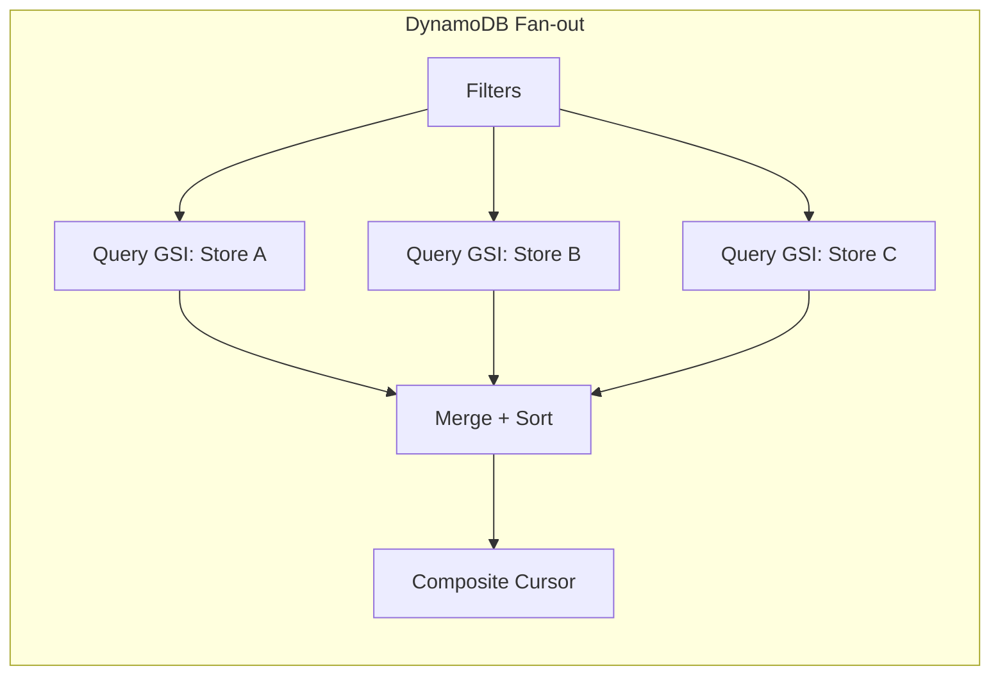
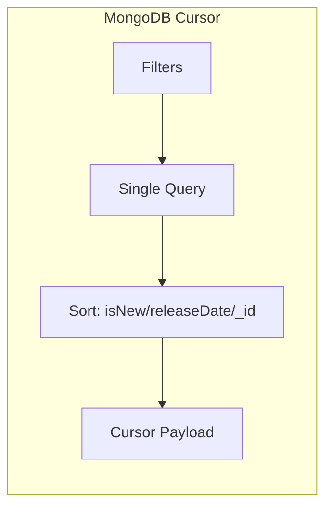

# Architecture Notes

## Table of Contents
- [Web App (takonbini-web)](#web-app-takonbini-web)
  - [Product Listing Pagination](#product-listing-pagination)
  - [Image Proxy & Caching](#image-proxy--caching)
- [Server Side (Private Repo)](#server-side-private-repo)
  - [High-Level Architecture](#high-level-architecture)
  - [Core Components](#core-components)
  - [Decisions and Trade-offs](#decisions-and-trade-offs)
  - [Operational Considerations](#operational-considerations)
  - [Repository Structure & Deployment](#repository-structure--deployment)
- [Technology Stack Summary](#technology-stack-summary)

## Web App (takonbini-web)

### Product Listing Pagination

#### Data Flow (SSR + Client)
1. **Route Loader (SSR)**
   - Prefetch the first page of products using TanStack Query.
   - Store the result in the query cache for hydration.

2. **Client Hydration**
   - TanStack Query hydrates the prefetched page on first render.
   - UI shows the first page immediately without a loading flash.

3. **Paginated Fetching**
   - Use `useInfiniteQuery` with:
     - `queryFn` calling `/products?cursor=...`
     - `getNextPageParam` reading `nextCursor` from the API response.
   - When user clicks "Load more" (or an observer hits the sentinel), fetch the next page.

4. **Rendering**
   - Flatten `data.pages` into a single array for rendering.
   - **(Future Phase)** Use list virtualization (`@tanstack/react-virtual`) for large lists.
     - Only render the visible window of items and recycle DOM nodes.
     - Keeps the DOM small even if many pages are loaded in memory.
     - Optional: cap in-memory pages (e.g. keep last N pages) to limit memory further.



### Image Proxy & Caching

- Product images are fetched through the app's image proxy (`/api/image?url=...`) instead of directly from store domains.
- This avoids CORS errors on third-party image hosts and keeps layout stable even when the browser blocks direct reads.
- The proxy sets cache headers for browser + edge caching to improve repeat-load performance and reduce origin hits.



## Server Side (Private Repo)

### High-Level Architecture





### Core Components

#### Scraping Service (MVP: Local Execution)
- **Technology:** Local Docker containers (orchestrated via Docker Compose).
- **Runtime:** Node.js + Playwright (official image).
- **Workflow:**
  - **Trigger:** User manually runs `./run-scraper.sh`.
  - **Execution:** Docker Compose spins up 3 isolated containers (`scraper-lawson`, `scraper-familymart`, `scraper-seven`).
  - **Processing:** Each container scrapes, translates (OpenAI), and upserts data to MongoDB.
- **Future Phase (Cloud):** Designed to migrate to Fargate, triggered by EventBridge.

#### Database: MongoDB Atlas
The application uses **MongoDB Atlas** with a single `products` collection to support flexible, multi-select filtering and sorting.

**Schema Definition (Products Collection):**
- **_id:** `id` (String, unique)
- **Fields:**
  - `title` (Map: ja, en, zh)
  - `description` (Map: ja, en, zh)
  - `price` (Number)
  - `releaseDate` (String: ISO8601)
  - `store` (String Enum: "SevenEleven", "Lawson", "FamilyMart")
  - `isNew` (Boolean)
  - `category` (String Enum: "Bento", "Onigiri", "Sandwich", etc.)
  - `regions` (List of Strings: ["Kanto", "Kansai", "Okinawa", ...])
  - `searchKeywords` (String: normalized, case-insensitive text)
  - `images` (List of URLs)
  - `url` (String)
  - `expiresAt` (Date, TTL)

**Indexes:**
- TTL index on `expiresAt` to auto-expire stale products.
- Additional indexes added as filter usage patterns stabilize (e.g., store/category/releaseDate).

**Query Strategy Notes:**
- Multi-select filters use native MongoDB queries (`$in`, range filters).
- Sorting defaults to `isNew`, then `releaseDate` (desc), then `_id` for stable pagination, with items missing a release date at the end.
- Status filtering is handled via a `status` query param (`new`, `soon`, `all`, `allWithoutSoon`) using release dates in JST.
- Cursor pagination uses a composite cursor based on `releaseDate` presence, `releaseDate`, and `_id`.

#### Translation Service
- **Provider:** OpenAI API (`gpt-5-nano`).
- **Workflow:** Japanese text is extracted during scraping and batched for translation into English and Chinese before storage.

#### Image Hosting (Planned / Future Work)
- **Strategy:** For MVP, the app fetches images through the `/api/image` proxy.
- **Future State:** Implement an S3 pipeline to download and host images to reduce link rot risk.

#### Data Retention & Cleanup Strategy
- **Heartbeat:** Each scraper run updates `expiresAt` for all found products to **Current Time + 14 Days**.
- **Automatic Expiration:** If a product disappears, TTL deletes it after expiration.
- **No Manual Cleanup:** The TTL index handles retention without additional jobs.

### Decisions and Trade-offs

#### DynamoDB vs MongoDB
**DynamoDB**
- Pros
  - Predictable performance and cost for well-defined access patterns.
  - Low operational overhead with serverless scaling.
  - Strong consistency options and simple primary-key lookups.
- Cons
  - Multi-select UI filters require many GSIs or fan-out queries.
  - Pagination across multiple partitions requires composite cursors and merge logic.
  - Sorting across mixed filters is hard without precomputed indexes.

**MongoDB**
- Pros
  - Flexible querying for multi-select filters (`$in`, ranges, regex search).
  - Native sorting and cursor pagination without fan-out.
  - Easier schema evolution as filters and fields change.
- Cons
  - Requires index tuning to keep queries fast as data grows.
  - More operational considerations (connection pooling, cluster sizing).

**Why MongoDB was chosen:** MongoDB best matches the product list UI, which depends on multiple optional filters, range queries, and stable sorting.

**Pagination complexity in DynamoDB (fan-out + merge):**


```ts
// Fan-out across N partitions (stores/categories), then merge in memory
const pages = await Promise.all(plans.map((plan) => queryIndex(plan, cursorMap[plan.id])));

// Deduplicate items that appear in multiple partitions
const deduped = new Map<string, Product>();
for (const page of pages) {
  for (const item of page.items) {
    deduped.set(item.id, item);
  }
}

// Sort by isNew desc, releaseDate desc, then id for a stable order
const sorted = [...deduped.values()].sort(sortByIsNewReleaseDateId);
const pageItems = sorted.slice(0, limit);

// Build a composite cursor per partition to resume pagination
const nextCursor = buildCompositeCursor(pages, pageItems);
```

**Equivalent MongoDB query:**


```ts
// Single query with filters, sort, and cursor
const query = { store: { $in: stores }, category: { $in: categories } };
const results = await collection
  .find(query)
  .sort({ isNew: -1, releaseDate: -1, _id: 1 })
  .limit(limit + 1)
  .toArray();
```

#### OpenAI vs Amazon Translate
**OpenAI**
- Pros
  - Better handling of context-heavy food/product descriptions.
  - More natural translations for marketing-style copy and menu terms.
  - Flexible prompt control for tone and formatting.
- Cons
  - Higher unit cost compared to Amazon Translate.
  - External provider dependency outside AWS.

**Amazon Translate**
- Pros
  - Cost-effective at scale and fully managed within AWS.
  - Easy IAM integration and predictable throughput.
- Cons
  - Less nuanced translations for culinary terms and product context.
  - Limited control over style and phrasing.

**Why OpenAI was chosen:** Translation quality for food names and descriptions is more important than marginal cost savings.

### Operational Considerations
- MongoDB Atlas access is controlled via database users and IP allowlists.
- Monitor query latency and add indexes as filters evolve.
- Ensure connection pooling is configured for Lambda reuse.

### Repository Structure & Deployment

#### Repository Structure
**Dual Repository Strategy**

**Repo 1: `takonbini-api` (Private)**
- **Contains:**
  - `services/scraper`: Scraper logic.
  - `packages/types`: Source of truth for data models.
  - `infra/`: Terraform code.

**Repo 2: `takonbini-web` (Public)**
- **Contains:**
  - `app/`: TanStack Start app.

**Directory Structure (Private Repo):**
```text
/takonbini-api (Private Repo)
  ├── packages/
  │   └── types/          # Shared interfaces
  ├── services/
  │   └── scraper/        # Scraper logic
  ├── apps/
  │   └── landing/        # (Future) Sales page for API
  └── infra/              # Terraform
```

**Directory Structure (Public Repo):**
```text
/takonbini-web (Public)
  ├── app/                # TanStack Start app
```

#### Deployment Strategy
- `services/scraper` (MVP): Run locally via `./run-scraper.sh` and `.env.local`.
- `services/scraper` (Future): Deployed to Fargate as a container image, triggered by EventBridge.
- `services/api`: Deployed to AWS Lambda behind API Gateway.
- `apps/web`: Deployed to Vercel, reading from MongoDB populated by the scraper.
- Future scalability: Add `apps/api-server` to reuse `packages/types` and DB logic.

## Technology Stack Summary

| Component | Choice | Reason |
| :--- | :--- | :--- |
| **IaC** | **Terraform** | Industry standard, robust state management. |
| **Compute** | **AWS Fargate** | Low cost for periodic workloads. |
| **Engine** | **Node.js** + **Playwright** | Best-in-class support for headless browsing and dynamic content. |
| **Language** | **TypeScript** | End-to-end type safety and code sharing. |
| **Frontend** | **TanStack Start** | Modern, full-stack React framework. |
| **Database** | **MongoDB** | Flexible querying for multi-select filters and native pagination. |
| **Storage** | **AWS S3** | Cost-effective object storage. |
